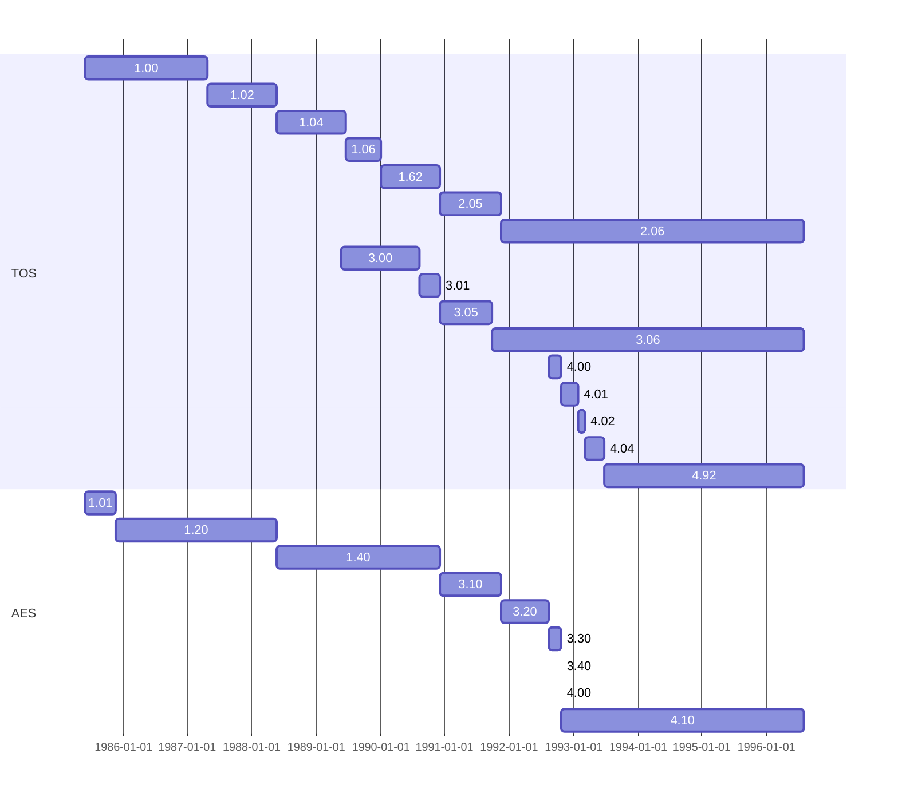
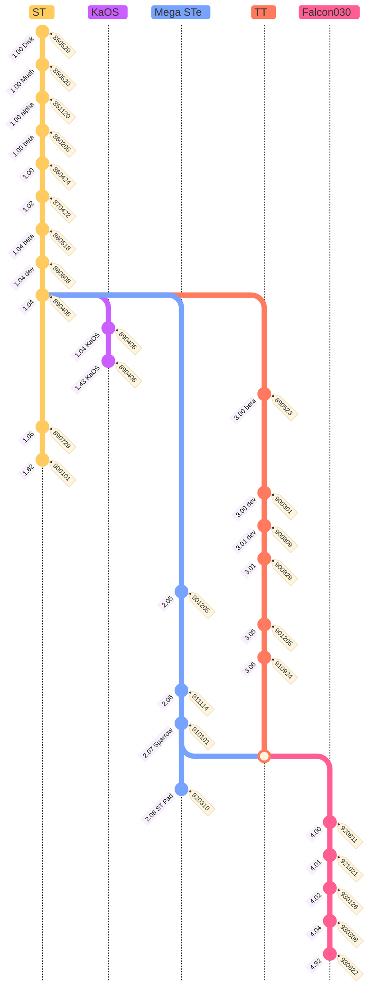

# TOS (The Operating System)

https://en.wikipedia.org/wiki/Atari_TOS

Other sources (click to expand)

https://www.atariworld.org/tos-rom/

http://www.jchr.be/atari/emulation.htm

https://computer.fandom.com/wiki/Atari_TOS

https://avtandil33.pythonanywhere.com/tose

https://mikro.naprvyraz.sk/docs/GEM/TOS.HTM

https://www.atari-computermuseum.de/tos.htm

http://hampa.ch/pub/software/ROM/Atari%20ST/

https://mikrosk.github.io/doitarchive/doit_st/0902.htm

http://msx.fab.free.fr/mpc2/atari/atari16-32/atari16-.htm

http://removers.free.fr/wikipendium/wakka.php?wiki=TosVersions

https://www.atari-wiki.com/index.php?title=History_of_Atari_TOS

https://home.deds.nl/~dwvdburg/atari/framesets/frameset_tos.html

https://www.storiainformatica.it/sistemi-operativi/atari-tos?view=category&id=58

System disks (click to expand)

https://www.atari.org/services/systemdisks.php

* Machines

| Version	| ST(f[^1])(m[^2])	| Mega ST			| STacy			| STe[^3]				| Mega STe				| ST Book				| TT							| Falcon030						|
| :---		| :---				| :---				| :---			| :---					| :---					| :---					| :---							| :---							|
| TOS		| 1.00				| 1.02				| 1.04			| 1.06					| 2.06					| 2.06					| 3.06							| 4.04							|
| Processor	| 68000 @ 8 MHz		| 68000 @ 8 MHz		| 68000 @ 8 MHz	| 68000 @ 16 MHz		| 68000 @ 8/16 MHz		| 68000 @ 8 MHz			| 68030 @ 16/32 MHz				| 68030 @ 16 MHz				|
| Cache		|					|					|				|						| 16 bytes				|						| 256 bytes						| 256 bytes						|
| Bus		| 16 bits			| 16 bits			| 16 bits		| 16 bits				| 16 bits				| 16 bits				| 32 bits						| 16 bits						|
| FPU		|					| 68881 (SFP004)	|				|						| 68881 (SFP004)		| 						| 68882 @ 32 MHz				| 68882 @ 16 MHz				|
| DSP		|					|					|				|						|						|						|								| 56001 @ 32 MHz				|
| BLiTTER	|					|					| Yes			| Yes					| Yes					|						|								| Yes							|
| Memory	| 512KB / 1MB		| 1/2/4 MB			| 512KB / 1MB	| 1/2/4 MB				| 1/2/4 MB				| 512KB / 1MB			| 2/4 MB + 16/256 MB TT-RAM		| 1/4/14 MB						|
| Video		| Shifter			| Shifter			| Shifter		| Shifter				| Shifter				| Shifter				| Shifter						| Videl							|
| Palette	| 16/512 colors		| 16/512 colors		| monochrome	| 16/4096 colors		| 16/4096 colors		| monochrome			| 256/4096 colors				| 256/262144 colors				|
| Genlock	|					|					|				| Yes					| Yes					|						|								| Yes							|
| Cartridge	| 128 KB			| 128 KB			| 128 KB		| 128 KB				| 128 KB				| 						| 128 KB						| 128 KB						|
| Sound PSG	| YM				| YM				| YM			| YM-3-8912				| YM					| YM-3-8912				| YM							| YM							|
| Sound PCM	| 					| 					| 				| 2 ch 8 bits @ 50 kHz	| 2 ch 8 bits @ 50 kHz	| 2 ch 8 bits @ 50 kHz	| 2 ch 8 bits @ 50 kHz			| 2/8(DSP) ch 16 bits @ 50 kHz	|
| Mic input	|					|					|				|						|						|						|								| 2 ch 16 bits @ 50 kHz			|
| MIDI		| Yes				| Yes				| Yes			| Yes					| Yes					| Yes					| Yes							| Yes							|
| Keyboard	| Internal			| External			| Internal		| Internal				| Internal				| Internal				| External						| Internal						|
| Joypad	|					|					|				| 2 x DB15				| 2 x DB15				|						|								| 2 x DB15						|
| Floppy	| DD (external)		| DD (internal)		| DD (internal)	| DD (internal)			| DD/HD (internal)		| (DD external)			| DD/HD (external + internal)	| HD (internal)					|
| ACSI		| (external)		| (external)		| (external)	| (external)			| (external + internal)	| (external)			| Internal						| Internal (2.5" IDE laptop)	|
| SCSI		| 					| 					| 				| 						| 						| 						| SCSI-1 (internal + DB-25 ext)	| SCSI-1 (external mini DB-50)	|
| Parallel	| Yes				| Yes				| Yes			| Yes					| Yes					| Yes					| Yes							| Yes							|
| VME		| 					| 					| 				| 						| Yes					| 						| Yes							| 								|
| Serial	| 38400 bauds		| 38400 bauds		| 38400 bauds	| 38400 bauds			| 38400 bauds x 3		| 38400 bauds			| 115200 bauds (2 int)			| 115200 bauds					|
| Modem		| 					| 					| 				| 						| 						| 						| 115200 bauds (2 BD-9 ext)		| 								|
| LocalTalk	| 					| 					| 				| 						| Yes					| 						| Yes							| Yes							|

[^1]: f = floppy drive (internal)
[^2]: m = modulator output (TV)
[^3]: e = enhanced, like the 130 XE vs XL

* Characteristics

| Version	| Date			| Machine					| Size		| Start		| End (+1)	| GEMDOS	| VDI		| AES		| Note				|
| :---		| :---			| :---						| :---		| :---		| :---		| :---		| :---		| :---		| :---				|
| 1.00		| 1985/05/29	| ST						| 			| RAM		| RAM		| 0.D0		| 			| 1.01		| Disk				|
| 1.00		| 1985/06/20	| ST						| 			| 			| 			| 0.11		| 			| 1.01		| Mushroom TOS		|
| 1.00		| 1985/11/20	| ST						| 192 KB	| $FC0000	| $FF0000	| 0.13		| 			| 1.20		| Alpha				|
| 1.00		| 1986/02/06	| ST						| 192 KB	| $FC0000	| $FF0000	| 0.13		| 			| 1.20		| Beta				|
| 1.00		| 1986/04/24	| ST						| 192 KB	| $FC0000	| $FF0000	| 0.13		| 			| 1.20		| 					|
| 1.02		| 1987/04/22	| STf - Mega ST				| 192 KB	| $FC0000	| $FF0000	| 0.13		| 			| 1.20		| Blitter			|
| 1.04		| 1988/05/18	| STf - Mega ST	- STacy		| 192 KB	| $FC0000	| $FF0000	| 0.15		| 			| 1.40		| Beta				|
| 1.04		| 1988/08/08	| STf - Mega ST	- STacy		| 192 KB	| $FC0000	| $FF0000	| 0.15		| 			| 1.40		| Developer			|
| 1.04		| 1989/02/22	| STf - Mega ST	- STacy		| 192 KB	| $FC0000	| $FF0000	| 0.15		| 			| 1.40		| 					|
| 1.04		| 1989/04/06	| STf - Mega ST	- STacy		| 192 KB	| $FC0000	| $FF0000	| 0.15		| 			| 1.40		| Rainbow TOS		|
| 1.04 KaOS	| 1989/04/06	| ST						| 192 KB	| $FC0000	| $FF0000	| 0.16		| 			| 1.41		| Custom TOS		|
| 1.43 KaOS	| 1989/04/06	| ST						| 192 KB	| $FC0000	| $FF0000	| 0.16		| 			| 1.41		| Custom TOS fixed	|
| 1.06		| 1989/06/19	| STe						| 256 KB	| $E00000	| $E40000	| 0.15		| 			| 1.40		| 					|
| 1.06		| 1989/07/29	| STe						| 256 KB	| $E00000	| $E40000	| 0.15		| 			| 1.40		| Need STE_FIX.PRG	|
| 1.62		| 1990/01/01	| STe						| 256 KB	| $E00000	| $E40000	| 0.17		| 			| 1.40		| 1.06 fixed		|
| 2.02		| 1990			| STe - Mega STe			| 256 KB	| $E00000	| $E40000	| 			| 			| 			| 					|
| 2.05		| 1990/12/05	| STe - Mega STe			| 256 KB	| $E00000	| $E40000	| 0.19		| 			| 3.10		| 					|
| 2.06		| 1991/11/14	| STe - Mega STe (and ST)	| 256 KB	| $E00000	| $E40000	| 0.20		| 			| 3.20		| Fuji boot logo	|
| 2.06		| 1991			| ST Book					| 512 KB	| $E00000	| $E80000	| 			| 			| 			| ROM disk as P:	|
| 2.07		| 1991			| Sparrow (FX-1 STe card)	| 			| 			| 			| 			| 			| 			| 					|
| 2.08		| 1992/03/10	| ST Pad (prototype)		| 512 KB	| $E00000	| $E80000	| 			| 			| 			| 					|
| 3.00		| 1989/05/23	| TT						| 512 KB	| $E00000	| $E80000	| 0.20		| 			| 3.20		| Beta				|
| 3.00		| 1990/03/01	| TT						| 512 KB	| $E00000	| $E80000	| 0.20		| 			| 3.20		| Developer			|
| 3.01		| 1990/08/09	| TT						| 512 KB	| $E00000	| $E80000	| 0.20		| 			| 3.20		| 					|
| 3.01		| 1990/08/29	| TT						| 512 KB	| $E00000	| $E80000	| 0.20		| 			| 3.20		| 					|
| 3.05		| 1990/12/05	| TT						| 512 KB	| $E00000	| $E80000	| 0.20		| 			| 3.20		| 					|
| 3.06		| 1991/09/24	| TT						| 512 KB	| $E00000	| $E80000	| 0.20		| 			| 3.20		| 					|
| 4.00		| 1992/08/11	| Falcon030 (FX-1 board)	| 512 KB	| $E00000	| $E80000	| 0.30		| 			| 3.30		| Beta				|
| 4.01		| 1992/10/21	| Falcon030					| 512 KB	| $E00000	| $E80000	| 0.30		| 			| 3.40		| Developer			|
| 4.02		| 1993/01/26	| Falcon030					| 512 KB	| $E00000	| $E80000	| 0.30		| 			| 3.40		| 					|
| 4.03		| 1993			| Falcon030					| 512 KB	| $E00000	| $E80000	| 0.30		| 			| 3.40		| 					|
| 4.04		| 1993/03/08	| Falcon030					| 512 KB	| $E00000	| $E80000	| 0.30		| 			| 3.40		| 					|
| 4.92		| 1993/06/22	| Falcon030					| 512 KB	| RAM		| RAM		| 0.30		| 			| 4.10		| Beta (MultiTOS)	|
| 4.98		| 1993			| Falcon030					| 512 KB	| RAM		| RAM		| 			| 			| 			| 					|
| 5.00		|				|							| 1024 KB	| $E00000	| $F00000	| 			| 			| 			| 					|

This doesn't include the releases of : EmuTOS, MiNT (Not), MultiTOS (Now), FreeMINT, ...

## GEMDOS (GEM Disk Operating System)

| Version	| 0.11		| 0.13		| 0.16		| 0.17		| 0.19		| 0.20		| 0.30		|
| :---		| :---		| :---		| :---		| :---		| :---		| :---		| :---		|
| 			|

Alternative : PowerDOS, TurboDOS

## VDI (Virtual Device Interface)

| Version	| 			| 			| 			| 			| 			| 			| 			|
| :---		| :---		| :---		| :---		| :---		| :---		| :---		| :---		|
| 			|

Alternative : Quick ST, NVDI, fVDI

## AES (Application Environment Services)

| Version	| 1.01		| 1.20		| 1.40		| 3.10		| 3.20		| 3.40		| 4.00		| 4.10		|
| :---		| :---		| :---		| :---		| :---		| :---		| :---		| :---		| :---		|
| 			|

Alternative : Geneva, XaAES, N.AES, MyAES

## GEM (Graphic Environment Manager)

| Version	| 			| 			| 			| 			| 			| 			| 			|
| :---		| :---		| :---		| :---		| :---		| :---		| :---		| :---		|
| 			|

Alternative : Ease, Gemini, Jinnee, Neodesk, Teradesk, Thing

## GDOS (Graphics Device Operating System)

| Version	| 			| 			| 			| 			| 			| 			| 			|
| :---		| :---		| :---		| :---		| :---		| :---		| :---		| :---		|
| 			|

Alternative : AMC GDOS, G+Plus, FontGDOS, FSM GDOS, TTF-GDOS, SpeedoGDOS, NVDI
