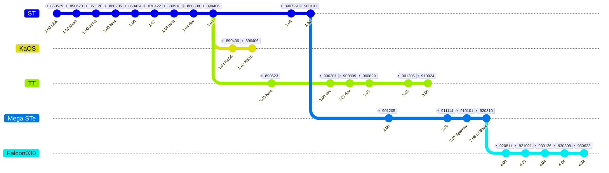

# TOS (The Operating System)

| Version	| Date			| Machine				| Size		| Address	| GEMDOS	| VDI		| AES		| Note				|
| :---		| :---			| :---					| :---		| :---		| :---		| :---		| :---		| :---				|
| 1.00		| 1985/05/29	| ST					| 			| RAM		| 0.D0		| 			| 1.01		| Disk				|
| 1.00		| 1985/06/20	| ST					| 			| 			| 0.11		| 			| 1.01		| Mushroom TOS		|
| 1.00		| 1985/11/20	| ST					| 192 KB	| $FC0000	| 0.13		| 			| 1.20		| Disk				|
| 1.00		| 1986/02/06	| ST					| 192 KB	| $FC0000	| 0.13		| 			| 1.20		| ROM				|
| 1.00		| 1986/04/24	| ST					| 192 KB	| $FC0000	| 0.13		| 			| 1.20		| 					|
| 1.02		| 1987/04/22	| STf - Mega ST			| 192 KB	| $FC0000	| 0.13		| 			| 1.20		| Blitter			|
| 1.04		| 1988/05/18	| STf - Mega ST	- STacy	| 192 KB	| $FC0000	| 0.15		| 			| 1.40		| Beta				|
| 1.04		| 1988/08/08	| STf - Mega ST	- STacy	| 192 KB	| $FC0000	| 0.15		| 			| 1.40		| Developer			|
| 1.04		| 1989/02/22	| STf - Mega ST	- STacy	| 192 KB	| $FC0000	| 0.15		| 			| 1.40		| 					|
| 1.04		| 1989/04/06	| STf - Mega ST	- STacy	| 192 KB	| $FC0000	| 0.15		| 			| 1.40		| Rainbow TOS		|
| 1.04 KaOS	| 1989/04/06	| ST					| 192 KB	| $FC0000	| 0.16		| 			| 1.41		| Custom TOS		|
| 1.43 KaOS	| 1989/04/06	| ST					| 192 KB	| $FC0000	| 0.16		| 			| 1.41		| Custom TOS fixed	|
| 1.06		| 1989/06/19	| STe					| 256 KB	| $E00000	| 0.15		| 			| 1.40		| 					|
| 1.06		| 1989/07/29	| STe					| 256 KB	| $E00000	| 0.15		| 			| 1.40		| Need STE_FIX.PRG	|
| 1.62		| 1990/01/01	| STe					| 256 KB	| $E00000	| 0.17		| 			| 1.40		| 1.06 fixed		|
| 2.02		| 1990			| STe - Mega STe		| 256 KB	| $E00000	| 			| 			| 			| 					|
| 2.05		| 1990/12/05	| STe - Mega STe		| 256 KB	| $E00000	| 0.19		| 			| 3.10		| 					|
| 2.06		| 1991/11/14	| STe - Mega STe (- ST)	| 256 KB	| $E00000	| 0.20		| 			| 3.20		| Fuji boot logo	|
| 2.07		| 1991			| Sparrow (aka "FX-1")	| 			| 			| 			| 			| 			| 					|
| 2.08		| 1992/03/10	| STBook				| 512 KB	| $E00000	| 			| 			| 			| 					|
| 3.00		| 1989/05/23	| TT					| 512 KB	| $E00000	| 0.20		| 			| 3.20		| Beta				|
| 3.00		| 1990/03/01	| TT					| 512 KB	| $E00000	| 0.20		| 			| 3.20		| Developer			|
| 3.01		| 1990/08/09	| TT					| 512 KB	| $E00000	| 0.20		| 			| 3.20		| 					|
| 3.01		| 1990/08/29	| TT					| 512 KB	| $E00000	| 0.20		| 			| 3.20		| 					|
| 3.05		| 1990/12/05	| TT					| 512 KB	| $E00000	| 0.20		| 			| 3.20		| 					|
| 3.06		| 1991/09/24	| TT					| 512 KB	| $E00000	| 0.20		| 			| 3.20		| 					|
| 4.00		| 1992/08/11	| Falcon030				| 512 KB	| $E00000	| 0.30		| 			| 3.30		| Beta				|
| 4.01		| 1992/10/21	| Falcon030				| 512 KB	| $E00000	| 0.30		| 			| 3.40		| Developer			|
| 4.02		| 1993/01/26	| Falcon030				| 512 KB	| $E00000	| 0.30		| 			| 3.40		| 					|
| 4.03		| 1993			| Falcon030				| 512 KB	| $E00000	| 0.30		| 			| 3.40		| 					|
| 4.04		| 1993/03/08	| Falcon030				| 512 KB	| $E00000	| 0.30		| 			| 3.40		| 					|
| 4.92		| 1993/06/22	| Falcon030				| 512 KB	| RAM		| 0.30		| 			| 4.10		| Beta (MultiTOS)	|

This doesn't include the releases of : EmuTOS, MiNT (Not), MultiTOS (Now), FreeMINT, ...

## GEMDOS (GEM Disk Operating System)

| Version	| 0.11		| 0.13		| 0.16		| 0.17		| 0.19		| 0.20		| 0.30		|
| :---		| :---		| :---		| :---		| :---		| :---		| :---		| :---		|
| 			|

Alternative : PowerDOS

## VDI (Virtual Device Interface)

| Version	| 			| 			| 			| 			| 			| 			| 			|
| :---		| :---		| :---		| :---		| :---		| :---		| :---		| :---		|
| 			|

Alternative : QuickST, NVDI

## AES (Application Environment Services)

| Version	| 1.01		| 1.20		| 1.40		| 3.10		| 3.20		| 3.40		| 4.00		| 4.10		|
| :---		| :---		| :---		| :---		| :---		| :---		| :---		| :---		| :---		|
| 			|

Alternative : XaEAS, N.AES, MyAES

## GEM (Graphic Environment Manager)

| Version	| 			| 			| 			| 			| 			| 			| 			|
| :---		| :---		| :---		| :---		| :---		| :---		| :---		| :---		|
| 			|

Alternative : Gemini, Geneva, Magic

## GDOS (Graphics Device Operating System)

| Version	| 			| 			| 			| 			| 			| 			| 			|
| :---		| :---		| :---		| :---		| :---		| :---		| :---		| :---		|
| 			|

Alternative : AMC GDOS, G+Plus, FontGDOS, FSM GDOS, TTF-GDOS, SpeedoGDOS, NVDI

# Utilities

Patches have been made by Atari and third parties to correct some TOS flaws.

| Version		| 1.00	| 1.02	| 1.04	| 1.06	| 1.62	| 2.05	| 2.06	| 3.00	| 3.01	| 3.05	| 3.06	| 4.00	| 4.01	| 4.02	| 4.04	| 4.92	|
| :---			| :---	| :---	| :---	| :---	| :---	| :---	| :---	| :---	| :---	| :---	| :---	| :---	| :---	| :---	| :---	| :---	|
| AUTOSORT.PRG	| X		| X		| X		| X		| X		| X		| X		| X		| X		| X		| X		| X		| X		| X		| X		| X		|
| FOLDRXXX.PRG	| X		| X		| X		| X		| X		| X		| X		| X		| X		| X		| X		| X		| X		| X		| X		| X		|
| CACHEXXX.PRG	| 		| 		| X		| X		| X		| X		| X		| X		| X		| X		| X		| X		| X		| X		| X		| X		|
| POOLFIX3.PRG	| 		| 		| X		| X		| 		| 		| 		| 		| 		| 		| 		| 		| 		| 		| 		| 		|
| TOS14FIX.PRG	| 		| 		| X		| 		| 		| 		| 		| 		| 		| 		| 		| 		| 		| 		| 		| 		|
| TOS14FX5.PRG	| 		| 		| X		| 		| 		| 		| 		| 		| X		| 		| 		| 		| 		| 		| 		| 		|
| STE_FIX.PRG	| 		| 		| 		| X		| 		| 		| 		| 		| 		| 		| 		| 		| 		| 		| 		| 		|
| SELTOS.PRG	| X		| 		| X		| 		| 		| 		| X		| 		| 		| 		| 		| 		| 		| 		| 		| 		|
| SERPTCH2.PRG	| 		| 		| 		| 		| 		| X		| 		| 		| 		| X		| 		| 		| 		| 		| 		| 		|
| COLORTOS.PRG	| 		| 		| 		| 		| 		| 		| X		| 		| 		| 		| X		| 		| 		| 		| 		| 		|

* AUTOSORT.PRG: sorts the programs in the AUTO folder
* FOLDRXXX.PRG: fixes 40 folders limit (unless using some HD driver that fixes it too)
* CACHEXXX.PRG: adds cache buffers
* TOS14FIX.PRG: fixes FOLDRXXX.PRG
* TOS14FX5.PRG: fixes TOS14FIX.PRG
* STE_FIX.PRG: fixes booting in Medium resolution
* SERPTCH2.PRG: fixes MFP and SCC serial ports
* COLORTOS.PRG: adds support for colour DESKICON.RSC
* SELTOS.PRG: allows to load a ROM image into RAM and reboot on it
* GEMRAM.PRG: copies the ROM to RAM to patch TOS directly (used by other patches)
* ARROWFIX.PRG: fixes the up/down arrow scroll click lock (included in WINX.PRG)
* SHBUF.PRG: fixes the NEWDESK.INF 4KB limit (after GEMRAM.PRG)
* WINX.PRG: adds desktop features (after GEMRAM.PRG)
